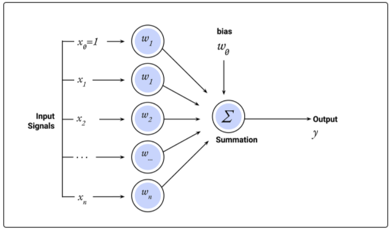

# Module 13 Challenge: Neural Networks
UNCC Online FinTech Bootcamp Module 13 Challenge due by 11:59pm 3/6/2022

image from [www.bootcampspot.com](https://courses.bootcampspot.com/courses/980/pages/13-dot-1-3-perceptron-the-computational-neuron?module_item_id=377709)

---

## Background

We work as risk management associates at Alphabet Soup, a venture capital firm. Alphabet Soup’s business team receives many funding applications from startups every day. This team has asked us to help them create a model that predicts whether applicants will be successful if funded by Alphabet Soup.

The business team has given us a CSV file containing more than 34,000 organizations that have received funding from Alphabet Soup over the years. The CSV file contains a variety of information about each business, including whether or not it ultimately became successful. With our knowledge of machine learning and neural networks, we decide to use the features in the provided dataset to create a binary classifier model that will predict whether an applicant will become a successful business.

---

## What's Being Created

To predict whether Alphabet Soup funding applicants will be successful, we will create a binary classification model using a deep neural network.

This challenge consists of three technical deliverables. We will do the following:

 - Preprocess data for a neural network model.

 - Use the model-fit-predict pattern to compile and evaluate a binary classification model.

 - Optimize the model.

---
## Technologies

This application is written in Python 3.7 using JupyterLab version 3.0.14.

Python libraries used:

 - [Pandas](https://pandas.pydata.org/pandas-docs/stable/) - *an open source, BSD-licensed library providing high-performance, easy-to-use data structures and data analysis tools for the Python programming language.*
 - [Pathlib](https://docs.python.org/3.7/library/pathlib.html) - *a library that enables consistent input and output of files from the main app.*
 - [scikit-learn](https://scikit-learn.org/stable/user_guide.html) - *an open source machine learning library that supports supervised and unsupervised learning.*
 - [TensorFlow](https://www.tensorflow.org/) - *an end-to-end open source platform for machine learning.*
 - [Keras](https://keras.io/about/) - *a deep learning API written in Python, running on top of the machine learning platform TensorFlow.*

### Installation Guide

prior to running these libraries, install them from the command line:
  - pandas: `conda install pandas` or `pip install pandas`  
  - pathlib: `pip install pathlib`
  - sklearn: `pip install-U scikit-learn` - included in conda
  - TensorFlow: `pip install tensorflow` or `pip install --upgrade tensorflow`
  - Keras: included in TensorFlow
---
## Usage

 ### 1. Preprocess data for a neural network model.

 ### 2. Use the model-fit-predict pattern to compile and evaluate a binary classification model.

 ### 3. Optimize the model.

---

## Contributors

Geoff Tarleton - jobeycat@protonmail.com

adapted from Starter Code supplied by UNCC FinTech Online Bootcamp by Trilogy Educational Services, a 2U, Inc. brand.

---

## License

[MIT](LICENSE)